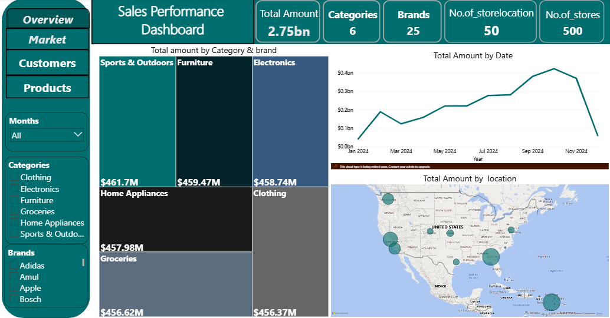

# Sales-Performance-Dashboard

## Project Overview
This project demonstrates end-to-end data analytics using SQL and Power BI to analyze sales performance across multiple dimensions including products, customers, campaigns, and geographical locations. The analysis provides actionable insights for business decision-making and strategic planning.
## Tech Stack
- SQL: Data cleaning, transformation, and preparation
- Power BI: Interactive dashboard development and DAX measures
- Data Modeling: Star schema with 1 fact table and 6-dimension tables
## Dataset Structure
The project works with 7 interconnected tables:
- 1 Fact table (Sales transactions)
- 6 Dimension tables (Products, Customers, Stores, Campaigns, Salesperson, Date)
## SQL Data Processing
### Key SQL Operations:
1. Data Type Corrections: Modified column data types for consistency and proper analysis
2. Column Merging: Combined related columns to create more meaningful data points
3. Calculated Columns: Added new columns to enhance analytical capabilities
4. Date Table Integration: Created a common column bridge to properly link the date dimension with the fact table
5. View Creation: Saved all queries as views for seamless Power BI integration with pre-configured relationships

## DAX Measures Created
- Total Amount (Revenue)
- Total Customers
- Total Products
- Number of Stores
- Number of Store Locations
- Campaign Budget
- Revenue by Time Period
- Revenue by Segment/Category/Brand
- Top/Bottom N calculations

## Key Insights
### 1. Revenue Trends
- Launch Period: Strong upward momentum starting in February
- Growth Phase: Sustained upward trend through Q2 and Q3
- Q4 Decline: Notable revenue decrease in the last two months
- Recommendation: Investigate Q4 decline factors and implement corrective strategies for the following year

### 2. Geographic Performance
Top 5 Markets (>$70M each):
1. San Antonio
2. Fort Worth
3. Los Angeles
4. Washington
5. Fresno

Recommendation: 
- Expand marketing efforts in high-performing regions
- Analyze success factors for potential replication in underperforming markets
- Consider opening additional store locations in these strategic areas

### 3. Category Performance
Top Revenue Categories:
1. Sports & Outdoors: $461.7M
2. Furniture: $459.47M
3. Electronics: $458.74M

Lower Performing Categories:
- Home Appliances: $457.98M
- Groceries: $457.98M
- Clothing: $456.37M

Key Observations:
- All categories show relatively balanced performance ($456M-$461M range)
- Each category has distinct top and bottom performing products
- Product overlap exists across categories for certain brands

Recommendations:
- Focus on promoting underperforming products within each category
- Leverage successful products as loss leaders to boost category-wide sales
- Cross-sell products from high-performing brands across multiple categories

### 4. Customer Segmentation Analysis

Top 3 Customer Segments by Revenue:
1. Online Shopper: $277.65M
   - Primary categories: Electronics, Sports & Outdoors
   
2. Deal Seeker: $277.08M
   - Primary categories: Groceries, Sports & Outdoors, Clothing
   
3. Occasional Shopper: $277.08M
   - Primary categories: Electronics, Sports & Outdoors, Home Appliances

Other Segments:
- High Value: $276.44M
- Churn Risk: $275.56M
- Loyal Customer: $275.45M
- First-time Buyer: $274.13M
- Budget Shopper: $273.45M
- In-Store Regular: $274.13M
- Premium Shopper: $271.6M

Recommendations:
- Develop targeted marketing campaigns for each segment based on their category preferences
- Create personalized product recommendations for top customers within each segment
- Implement retention strategies for "Churn Risk" segment
- Develop conversion strategies to move "First-time Buyers" to "Loyal Customers"

### 5. Store Type Performance
Revenue Distribution:
- Supermarkets: $952.04M (34.61%) - Highest performing
- Small Stores/Shops: $927.28M (33.71%)
- Large Malls/Complex: $871.56M (31.68%)

Key Insight: Supermarkets outperform large malls by 3% and small stores by 1%, indicating customer preference for convenient, deal-oriented shopping experiences over large format retail.

Recommendations:
- Optimize supermarket format with competitive pricing and promotional offers
- Enhance small store experience to compete with supermarkets
- Reevaluate large mall strategy - consider reducing footprint or changing format

### 6. Sales Team Performance
Top Performing Role: Sales Associate (highest revenue contribution)

Recommendations:
- Analyze Sales Associate best practices and scale across the team
- Invest in training programs based on top performer techniques
- Review compensation structure to incentivize performance

### 7. Campaign Analysis
Total Campaigns: 50 campaigns with $28M total budget
Campaign Budget Range: $165K - $979K per campaign
Duration Range:14 - 258 days

Key Observations:
- Campaign performance shows relatively even distribution across all campaigns
- No clear correlation between campaign duration, budget, and revenue impact
- Some high-budget, short-duration campaigns vs. low-budget, long-duration campaigns
- Campaigns are not category-specific

Top Performing Campaigns:
1. Winter Clearance Carnival: 149 days, $640K budget, $55.66B revenue
2. New Arrival Showcase: 258 days, $191K budget, $55.45B revenue
3. Seasonal Surprise Box: 255 days, $802K budget, $55.42B revenue

Recommendations:
- Conduct ROI analysis for each campaign (revenue vs. budget)
- Test category-specific campaigns to drive targeted product sales
- Optimize campaign duration based on performance data
- Allocate budget more efficiently based on historical campaign success rates
- Consider seasonal patterns when planning campaign timing

### 8. Product Portfolio Insights
Cross-Category Brands: Several brands and products appear in multiple categories, indicating:
- Strong brand recognition across product lines
- Opportunity for bundled promotions
- Cross-selling potential

Top & Bottom 10 Products: Each category has distinct high and low performers
- Lower-performing categories appear more frequently in bottom 10
- Opportunity to improve product mix and merchandising strategies

Recommendations:
- Phase out consistently underperforming products
- Increase inventory and promotion of top performers
- Leverage cross-category brands for bundled offers

## Strategic Recommendations Summary

### Immediate Actions (0-3 months):
1. Investigate and address Q4 revenue decline
2. Launch targeted campaigns for underperforming customer segments
3. Optimize product mix by reducing bottom performers
4. Implement Sales Associate best practices across teams

### Short-term Initiatives (3-6 months):
1. Expand presence in top 5 geographic markets
2. Develop segment-specific marketing strategies
3. Redesign campaign approach with category focus
4. Enhance supermarket store format

### Long-term Strategy (6-12 months):
1. Open new locations in high-performing regions
2. Build customer loyalty programs for retention
3. Develop data-driven campaign budget allocation model
4. Implement predictive analytics for demand forecasting

## Project Outcomes
•	Successfully integrated and modeled complex multi-table dataset  
•	Created interactive, user-friendly dashboards for business stakeholders  
•	Identified key revenue drivers and growth opportunities  
•	Provided actionable recommendations based on data insights  
•	Demonstrated proficiency in SQL, Power BI, and analytical thinking  

## Skills Demonstrated
- SQL query writing and optimization
- Data cleaning and transformation
- Data modeling (Star Schema)
- DAX formula creation
- Power BI dashboard design
- Business intelligence analysis
- Data storytelling
- Strategic recommendation development
